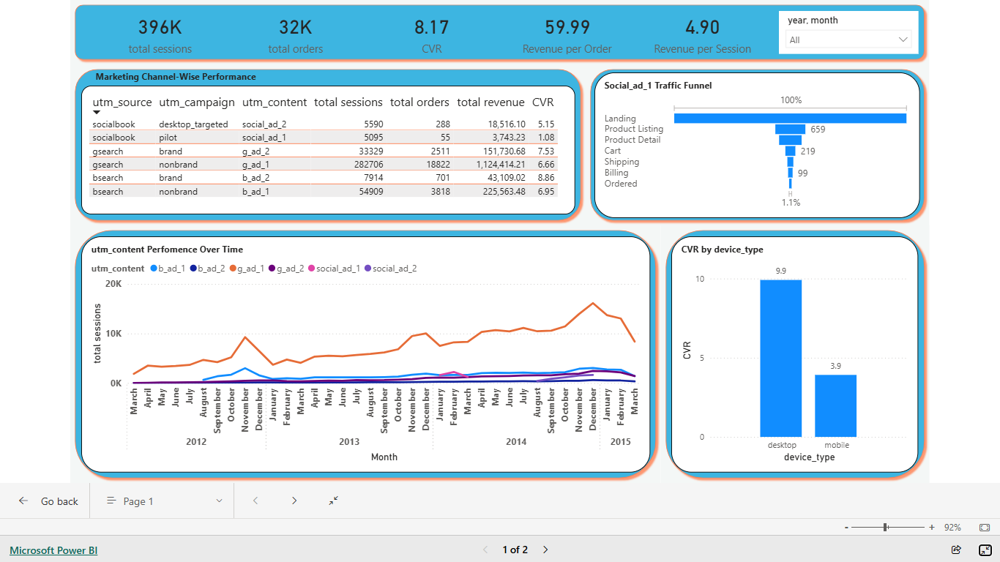

# Campaign Effectiveness & Funnel Optimization Analysis 📈
**Domain:** E-commerce (Toy Retailer) | **Tools:** SQL (MS SQL Server), Power BI, Python

## 📋 Business Scenario
The company observed a significant increase in marketing spend during the year-end peak season, but the overall profitability didn't scale proportionally. There was a lack of clarity on which marketing channels were driving high-quality traffic versus those wasting the budget. Additionally, the management noticed a high abandonment rate in the checkout process but couldn't pinpoint whether the issue was technical, device-specific, or related to the user journey. 

This project was initiated to audit the marketing effectiveness, identify funnel bottlenecks, and provide data-driven recommendations to optimize the ROI for the upcoming fiscal year.

---

## 🎯 Executive Summary
The primary objective of this project was to perform a comprehensive audit of marketing campaigns and the sales funnel. Analysis revealed that while **Q4 (Nov-Dec)** experienced stable growth driven by successful search campaigns, significant conversion leakages exist within **Social Media channels** and the **Mobile User Experience (UX)**. By rectifying these inefficiencies and scaling high-performing search campaigns (`g_ad_1`), the business can potentially increase revenue by **15-20%**.

## 📊 Dashboard Preview

## 🔍 Key Insights Buckets

### 1. Marketing & Campaign Performance
* **Seasonal Scaling:** A consistent traffic spike was observed every November and December (Q4). The primary driver is **Non-Brand Search (`g_ad_1`)**, which demonstrates high scalability by maintaining stable conversion rates even at high volumes.
* **Social Media Inefficiency:** The `social_ad_1` (Pilot) campaign has a critically low conversion rate (**~1.08%**). Root Cause Analysis (RCA) shows an **88% drop-off from the Lander to the Product Listing page**, indicating a severe mismatch between ad creatives and landing page content.
* **Brand Equity:** Brand campaigns show a high conversion rate (8.8%) but low traffic volume, suggesting a significant opportunity to increase organic brand awareness.

### 2. Conversion Funnel & UX Efficiency
* **Mobile Conversion Gap:** Mobile conversion (**3.91%**) significantly lags behind Desktop (**9.91%**). Mobile users experience a **Cart-to-Shipping drop-off** 10% higher than desktop users, signaling potential UI/UX friction or payment gateway issues on mobile devices.
* **A/B Testing Success:** The new `/billing-2` page outperformed the original `/billing` page, showing a measurable lift in conversion.
* **Temporal Patterns:** Order volume dips by **50% during weekends**, indicating that the product follows a weekday-dominant professional/corporate purchasing cycle.

### 3. Business & Unit Economics
* **Hero Product Identification:** "The Original Mr. Fuzzy" has remained the top-selling product since launch, contributing the majority of the total revenue share.
* **Retention Challenges:** Repeat sessions (**~30k**) are significantly lower than new acquisitions, and the repeat conversion rate is only **7%**. The business is currently overly dependent on new user acquisition.
* **Profitability Metrics:** Revenue Per Session (RPS) is stabilized at **$4.89**, with an Average Order Value (AOV) of **$59.99**.

---

## 💡 Strategic Recommendations
1.  **Optimize Mobile Checkout:** Immediate technical audit of the mobile payment gateway and form fields is required to bridge the 10% conversion gap.
2.  **Reallocate Marketing Budget:** Pause underperforming social media ads on `/lander-1` and `/lander-3` and reallocate the budget to high-performing `g_ad_1` campaigns.
3.  **Implement Retention Strategies:** Launch a Loyalty Program or Email Remarketing workflows to increase the current 7% repeat customer conversion rate.
4.  **Inventory Forecasting:** Maintain 1.5x stock levels for "Mr. Fuzzy" during Q4 to prevent stock-out losses during peak demand.

---

## 🛠️ Tech Stack & Methodology
* **SQL:** Utilized complex CTEs, and Joins for traffic sourcing and funnel drop-off calculations.
* **Power BI:** Developed interactive dashboards comparing Mobile vs. Desktop performance and seasonal trends.
* **Root Cause Analysis (RCA):** Conducted deep-dive analysis to identify specific leakage points in the user journey.

---

### ✍️ Author
**[Neeraj Singh]**
*Data Analyst | SQL | Power BI | Python*
<a href="https://www.linkedin.com/in/neerajsinghdatanerd/" target="_blank">[LinkedIn Profile Link]</a>
<a href="https://app.powerbi.com/view?r=eyJrIjoiM2Y1MmYwOTYtYTZjYi00NzRlLWI2Y2EtMDgwMDkxZmQ4NjhjIiwidCI6ImRmODY3OWNkLWE4MGUtNDVkOC05OWFjLWM4M2VkN2ZmOTVhMCJ9" target="_blank">[Power BI Report Link]</a>
